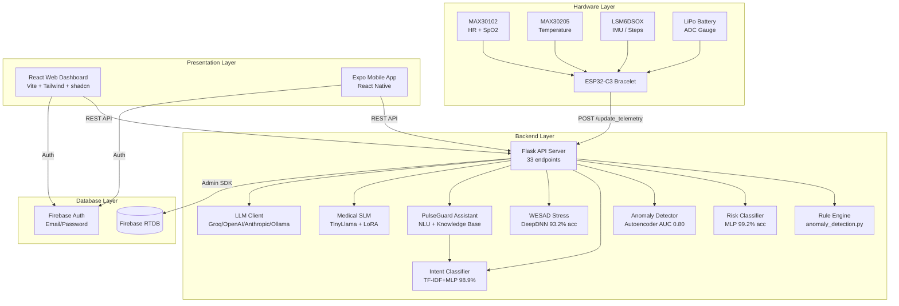
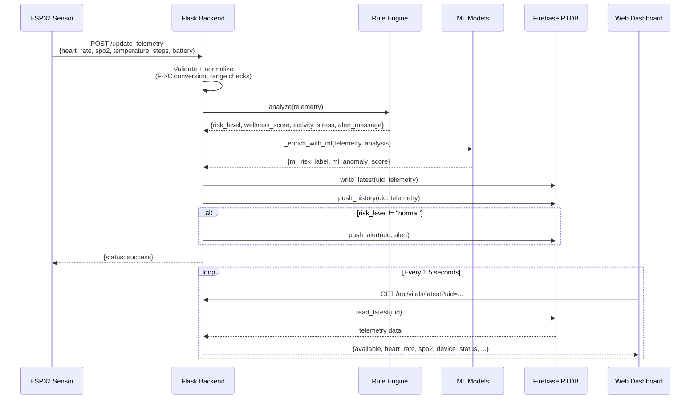
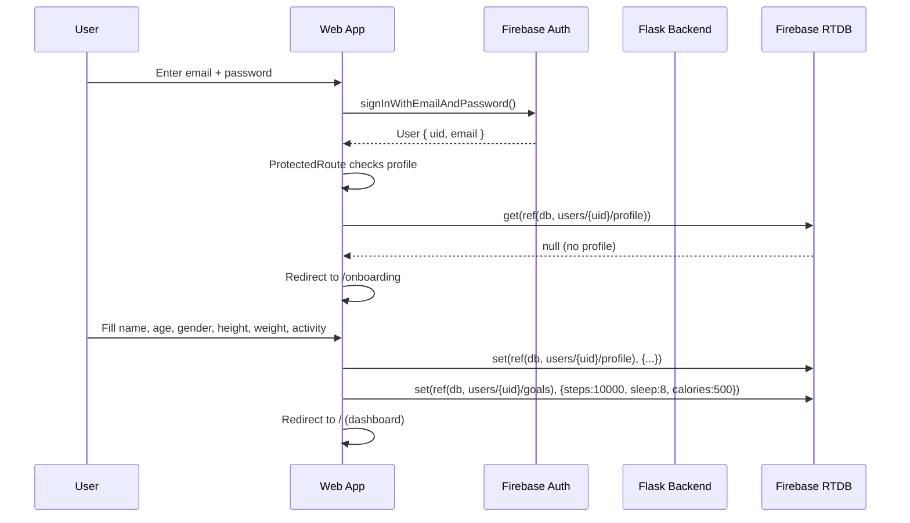
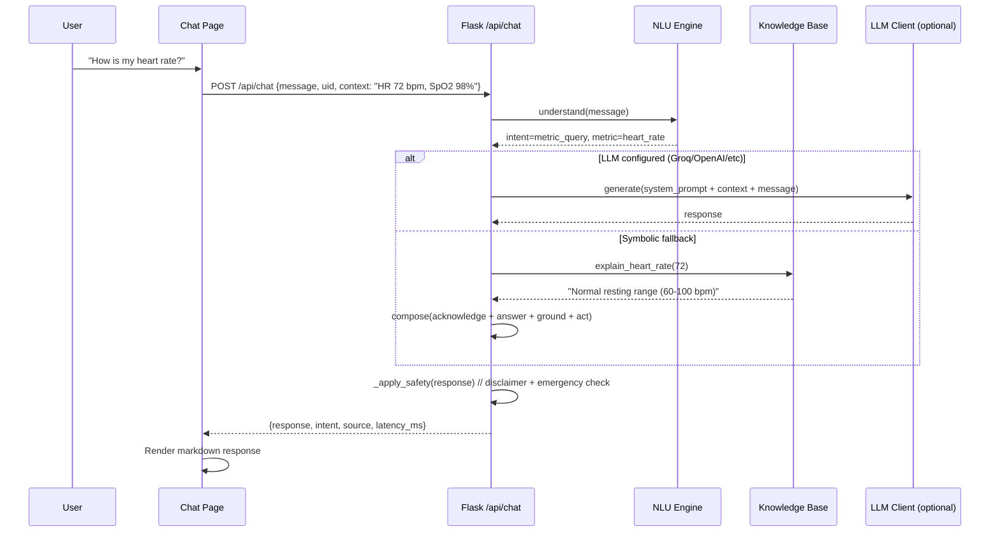

# PulseGuard AI - Complete Evidence Pack for Final Deliverables

> Generated from codebase analysis on 2026-06-20. Every claim is backed by file paths and line numbers.

---

## PART 1 - REPOSITORY AND PROJECT AUDIT

### 1.1 Project Title
**PulseGuard AI - Smart Health Monitoring Bracelet**
(Source: `README.md` line 1, `package.json` name: "pulseguard-ai-web", `mobile/app.json` name: "PulseGuard AI")

### 1.2 Team Information
(Source: `docs/team_contributions.md`)

| Member | Program | Role |
|--------|---------|------|
| **Omar Medhat** | DSAI | AI chatbot (TinyLlama + PEFT LoRA), Flask backend architecture, model loading, safety guardrails, fallback composer |
| **Asmaa Desokey** | DSAI | Health-data simulation, rule-based + statistical anomaly detection, patient scenarios, WESAD stress model |
| **Lama Omar** | Software Engineering | React + Vite dashboard, shadcn UI, Firebase Auth, mobile app, frontend-backend integration |

- **Student IDs**: NOT FOUND in codebase
- **Team Number**: NOT FOUND in codebase
- **Supervisor Name**: NOT FOUND in codebase

### 1.3 Repository Root Path
`C:\Users\DELL\Desktop\last\grad_trial\`

### 1.4 Main Folders and Purpose

| Folder | Purpose |
|--------|---------|
| `src/` | React + Vite + TypeScript web dashboard (pages, components, hooks, integrations) |
| `backend/` | Flask Python backend (API, Firebase, ML, chatbot, anomaly detection) |
| `firmware/` | ESP32-C3 Arduino firmware (sensor reading + HTTP POST) |
| `mobile/` | Expo React Native mobile app (iOS + Android + Web) |
| `backend/ml/` | ML model code (risk, anomaly, intent, stress, medical SLM) |
| `backend/ml/training/` | Training scripts for all models |
| `backend/models/` | Saved model artifacts, metrics JSONs, LoRA adapters |
| `backend/assistant/` | Rule-based health assistant (NLU, knowledge base, responder, memory) |
| `backend/tests/` | 22 pytest test files (~3,463 lines) |
| `docs/` | Project documentation (API, firebase, security, testing, deployment, etc.) |
| `final_evidence/` | Defense proof drawer (architecture, testing, demo script, AI components) |
| `load_tests/` | k6 + Locust performance test scripts |
| `public/` | Static assets (logo, manifest, service worker) |
| `.github/workflows/` | CI pipeline (pytest + vitest + ESLint + build) |

### 1.5 Main Entry Points

| Component | Entry Point | File |
|-----------|-------------|------|
| Frontend | `src/main.tsx` → `src/App.tsx` | React app root with routing |
| Backend | `python -m backend.app` | `backend/app.py` line 1662: `app = create_app()` |
| Firmware | `firmware/src/main.cpp` | Arduino `setup()` + `loop()` |
| ML Loading | `backend/ml/registry.py` line 32: `get_models()` | Lazy singleton loader |
| Mobile | `mobile/app/_layout.tsx` | Expo Router root |

### 1.6 Package/Dependency Files

| File | Purpose |
|------|---------|
| `package.json` | Frontend: React 18.3.1, Vite 5.4.19, Tailwind 3.4.17, Firebase 10.13.0, Recharts 2.15.4 |
| `backend/requirements.txt` | Backend: Flask 3.0.3, firebase-admin 6.5.0, scikit-learn 1.6.1, pandas, numpy |
| `backend/requirements-ai.txt` | Optional: torch, transformers, peft, tensorflow, catboost, xgboost, lightgbm |
| `backend/requirements-dev.txt` | Dev: pytest, coverage |
| `mobile/package.json` | Mobile: Expo SDK 51, React Native 0.74.5, Firebase 10.13.0 |
| `firmware/platformio.ini` | Firmware: ESP32-C3, ArduinoJson 7.0.4, SparkFun MAX3010x, SparkFun LSM6DSO |
| `docker-compose.yml` | Docker: backend + frontend + optional simulator services |
| `Dockerfile.frontend` | Nginx static build |
| `backend/Dockerfile` | Python backend container |

### 1.7 Run Commands

| Command | Purpose | Verified |
|---------|---------|----------|
| `python -m backend.app` | Start Flask backend (port 5000) | YES - runs successfully |
| `npm run dev` (or `npx vite`) | Start Vite frontend (port 8080) | YES - runs on 8081 (port conflict) |
| `cd mobile && npx expo start --lan` | Start Expo mobile dev server | YES - runs successfully |
| `pytest backend/tests -v` | Run backend tests (110 tests) | NOT RUN in this session |
| `npm test` | Run frontend tests (54 vitest tests) | NOT RUN in this session |
| `npm run build` | Production frontend build | NOT RUN |
| `docker compose up --build` | One-command deployment | NOT RUN |
| `python -m backend.ml.training.train_all` | Train all ML models | NOT RUN |

---

## PART 2 - DELIVERABLES EVIDENCE MAP

### A. Final Report / Thesis

| Section | Evidence Found | File Paths | Missing |
|---------|---------------|------------|---------|
| **Abstract** | Project description in README.md | `README.md` lines 1-20 | Needs formal abstract writing |
| **Introduction / Problem** | Chronic disease monitoring, elderly care, athlete tracking | `README.md`, `docs/final_defense_answers.md` | Formal problem statement |
| **System Design** | Full architecture, data flow, component diagram | `docs/data_flow.md`, `docs/api.md`, `docs/firebase.md` | Needs formal diagrams |
| **Implementation** | Complete codebase with 33 API endpoints, 8 pages, 4 ML models | All source files | Well documented |
| **Testing** | 110 backend + 54 frontend tests, load tests | `backend/tests/`, `src/**/*.test.*`, `load_tests/` | Needs formatted results |
| **Results** | ML metrics in JSON files, model comparison tables | `backend/models/*_metrics.json` | Needs formatted tables |
| **Ethics/Compliance** | Medical disclaimer, safety rails, no diagnosis claims | `backend/chatbot_service.py:55-73`, `docs/security.md` | Needs formal ethics section |
| **User Guide** | Setup in README, deployment docs | `README.md`, `docs/deployment.md`, `backend/SETUP_WINDOWS.md` | Needs polished guide |
| **References** | Libraries, datasets, frameworks used | `package.json`, `requirements.txt`, notebooks | Needs formal citations |

### B. README / GitHub Submission

| Section | Evidence | Status |
|---------|----------|--------|
| Project description | YES | `README.md` |
| Features list | YES | `README.md` |
| Architecture | YES | `README.md`, `docs/data_flow.md` |
| Technologies | YES | All package files |
| Setup instructions | YES | `README.md`, `docs/deployment.md` |
| API documentation | YES | `docs/api.md`, `docs/openapi.yaml` |
| Database schema | YES | `docs/firebase.md`, `firebase.rules.json` |
| Screenshots | PARTIAL | `final_evidence/dashboard/`, `final_evidence/mobile/` |

### C. Presentation

| Section | Evidence Source |
|---------|---------------|
| Title slide | `README.md`, `mobile/app.json` |
| Problem statement | `README.md`, `docs/final_defense_answers.md` |
| Architecture | `docs/data_flow.md`, code analysis |
| Features | Full codebase |
| Testing/evaluation | `backend/models/*_metrics.json`, test files |
| Demo flow | `docs/demo_script.md` (8-minute walkthrough) |
| Challenges | `docs/final_defense_answers.md` (22 Q&A) |

### D. Poster
All information available from codebase. Needs: formatted metrics tables, architecture diagram, QR code placeholder.

### E. Demo Video
`docs/demo_script.md` provides complete 8-minute demo flow: pitch -> mobile -> web -> alerts -> chatbot -> observability -> tests -> resilience.

---

## PART 3 - SYSTEM ARCHITECTURE

### 3.1 High-Level Architecture

PulseGuard AI is a 4-tier health monitoring system:
1. **Hardware Layer**: ESP32-C3 wearable bracelet with MAX30102 (HR/SpO2), MAX30205 (temperature), LSM6DSOX (IMU/steps)
2. **Backend Layer**: Flask API with rule-based anomaly detection, ML inference, Firebase RTDB persistence
3. **Database Layer**: Firebase Realtime Database for user-scoped telemetry, alerts, profiles, goals
4. **Presentation Layer**: React web dashboard + Expo React Native mobile app

### 3.2 Component Diagram (Mermaid)



### 3.3 Data Flow Diagram (Mermaid)



### 3.4 Sequence Diagram: User Login + Onboarding



### 3.5 Sequence Diagram: Chatbot Request



---

## PART 4 - FRONTEND ANALYSIS

### 4.1 Framework and Tooling

| Technology | Version | Purpose |
|-----------|---------|---------|
| React | 18.3.1 | UI framework |
| Vite | 5.4.19 | Build tool + dev server |
| TypeScript | 5.8.3 | Type safety |
| Tailwind CSS | 3.4.17 | Utility-first styling |
| shadcn/ui (Radix) | Various ^1.x-2.x | Accessible UI primitives |
| Recharts | 2.15.4 | Charts (heart rate trends) |
| React Router | 6.30.1 | Client-side routing |
| React Query | 5.83.0 | Server state management |
| Firebase SDK | 10.13.0 | Auth + RTDB client |
| Lucide React | 0.462.0 | Icon library |
| Zod | 3.25.76 | Schema validation |
| React Hook Form | 7.61.1 | Form management |

### 4.2 Page Inventory

| Route | Component File | Purpose | Data Source | Screenshot |
|-------|---------------|---------|-------------|------------|
| `/auth` | `src/pages/Auth.tsx` | Login / Signup / Password reset / Demo mode | Firebase Auth | `01_login.png` |
| `/onboarding` | `src/pages/Onboarding.tsx` | First-time profile setup (6 required fields) | Firebase RTDB write | `02_onboarding.png` |
| `/` | `src/pages/Index.tsx` | Main dashboard: vitals, risk, alerts, chart, insights | `GET /api/vitals/latest` (1.5s poll) | `03_dashboard.png` |
| `/analytics` | `src/pages/Analytics.tsx` | Trend charts, daily/weekly reports, CSV export | `GET /api/reports/*`, history | `05_analytics.png` |
| `/alerts` | `src/pages/Alerts.tsx` | Current + historical alerts, severity badges | `useLiveTelemetry().alerts` | `06_alerts.png` |
| `/chat` | `src/pages/Chat.tsx` | AI health assistant with vitals context | `POST /api/chat` | `09_chatbot.png` |
| `/profile` | `src/pages/Profile.tsx` | User profile edit, goals, photo upload | Firebase RTDB read/write | `07_profile.png` |
| `*` | `src/pages/NotFound.tsx` | 404 page | None | — |

### 4.3 Key Components

| Component | File | Purpose |
|-----------|------|---------|
| MetricCard | `src/components/MetricCard.tsx` | Display single vital (HR, SpO2, temp, etc.) with status badge + progress |
| RiskHeroCard | `src/components/RiskHeroCard.tsx` | Large risk level indicator (normal/warning/high) + wellness score |
| VitalsChart | `src/components/VitalsChart.tsx` | Heart rate trend (Recharts AreaChart) |
| HealthInsights | `src/components/HealthInsights.tsx` | Plain-language health recommendations |
| ModelInsight | `src/components/ModelInsight.tsx` | ML model outputs (risk classifier + anomaly detector) |
| ProactiveAlertCard | `src/components/ProactiveAlertCard.tsx` | Anti-spam alert popup (deduped by condition) |
| AlertSummary | `src/components/AlertSummary.tsx` | Compact alert strip on dashboard |
| TelemetrySourceBadge | `src/components/TelemetrySourceBadge.tsx` | Data source indicator (Connected/Stale/Disconnected) |
| StatusBadge | `src/components/StatusBadge.tsx` | Health status chip (normal/warning/danger) |
| AppLayout | `src/components/AppLayout.tsx` | Sidebar navigation + mobile hamburger |
| ErrorBoundary | `src/components/ErrorBoundary.tsx` | React crash handler |
| 50+ shadcn/ui | `src/components/ui/*.tsx` | Radix UI primitives (button, card, dialog, etc.) |

### 4.4 Data Handling

**useLiveTelemetry hook** (`src/hooks/useLiveTelemetry.ts`):
- Polls `GET /api/vitals/latest` every **1.5 seconds**
- Polls `GET /api/vitals/history?limit=200` every **4.5 seconds**
- Polls `GET /api/alerts` every **1.5 seconds**
- Polls `GET /api/goals` every **4.5 seconds**
- UID resolved from: `user.id` (logged in) OR `VITE_DEMO_USER_ID` (demo mode)
- Cache-busting: `?_=timestamp&uid=...` on every request
- Offline handling: keeps last known data, marks `source: "offline"`, `stale: true`
- **Never fabricates vitals** in the browser

**useAuth hook** (`src/hooks/useAuth.tsx`):
- Firebase `signInWithEmailAndPassword`, `createUserWithEmailAndPassword`
- Demo mode: stores `{id: "demo-user-001", isDemo: true}` in localStorage
- Auto-hydrates from `onAuthStateChanged` or localStorage

**Firebase client** (`src/integrations/firebase/client.ts`):
- Initializes Firebase App, Auth, and RTDB
- `fbPath` helper: `users/{uid}/latest_telemetry`, `profile`, `goals`, etc.
- Temperature normalization: handles Celsius, Fahrenheit, accidental x10 values
- Disabled gracefully if env vars missing (triggers demo mode)

---

## PART 5 - BACKEND ANALYSIS

### 5.1 Framework
Flask 3.0.3 with flask-cors 4.0.1, flask-limiter 3.8.0, gunicorn 22.0.0

### 5.2 Complete API Endpoint Inventory (33 endpoints)

See `docs/final_evidence_pack/API_INVENTORY.md` for the full table.

**Key endpoints:**

| Method | Path | Purpose | Rate Limit |
|--------|------|---------|------------|
| GET | `/health` | Liveness probe | default |
| POST | `/api/telemetry` | Ingest sensor reading | 60/min |
| GET | `/api/vitals/latest` | Normalized current state | default |
| GET | `/api/vitals/history` | Reading history | default |
| GET | `/api/alerts` | Current + historical alerts | default |
| POST | `/api/chat` | Chatbot with vitals context | 30/min |
| POST | `/api/simulate` | Generate synthetic reading | 30/min |
| POST | `/update_telemetry` | Legacy Arduino bridge | 60/min |
| POST | `/ai/medical-slm` | Medical LoRA model Q&A | default |
| POST | `/api/ml/predict/stress` | WESAD stress prediction | default |
| GET | `/api/profile` | User profile | default |
| POST | `/api/auth/bootstrap` | Create profile + goals on signup | default |
| PUT | `/api/profile/me` | Update profile (onboarding) | default |
| GET | `/api/reports/daily` | Daily health summary | default |
| GET | `/api/reports/export.csv` | CSV download | default |

### 5.3 /update_telemetry Full Analysis

**Location**: `backend/app.py` lines 1548-1665

**Accepted fields** (JSON or form data):
```json
{
  "heart_rate": 72,        // or "heartRate"
  "spo2": 98,              // or "SpO2" or "oxygen"
  "temperature": 98.6,     // Fahrenheit (auto-converted) or "temperature_c" for Celsius
  "steps": 0,
  "sleep_duration": 12,
  "battery_level": 83,     // or "battery"
  "fall_alert": false,
  "device_id": "optional",
  "user_id": "optional"
}
```

**Processing pipeline**:
1. Parse payload (JSON with `force=True`, or form data fallback)
2. Map fields to canonical schema (temperature F->C: `(F-32)*5/9`)
3. Run `analyze(telemetry)` -> risk_level, wellness_score, activity, stress
4. Enrich with ML models (risk classifier, anomaly detector)
5. Resolve UID: explicit -> device_pairing -> _last_frontend_uid -> FIREBASE_ACTIVE_UID -> DEFAULT_DEMO_UID
6. Write to Firebase: `write_latest(uid, telemetry)` + `push_history(uid, telemetry)`
7. Generate alert if `risk_level != "normal"`
8. Check battery level for low-battery alert
9. Return `{status: "success"}`

**UID tracking**: Backend tracks `_last_frontend_uid` from `?uid=` query params on all GET requests (line 397-399). When sensor sends data without a UID, it routes to whichever user is currently viewing the dashboard.

### 5.4 Rule Engine (anomaly_detection.py)

**Vital ranges** (WHO/AHA reference):

| Vital | Critical Low | Warning Low | Normal | Warning High | Critical High |
|-------|-------------|-------------|--------|-------------|--------------|
| Heart Rate (bpm) | <40 | <60 | 60-100 | >100 | >140 |
| SpO2 (%) | <92 | <95 | >=95 | — | — |
| Temperature (C) | — | <35.5 | 36.0-37.5 | >37.5 | >=38.5 |
| Battery (%) | — | <=5 | >20 | <=20 | — |

**Combined rules**:
- `overheating_risk`: HR>100 AND Temp>37.5 -> HIGH
- `oxygen_deficiency_risk`: SpO2<95 AND HR>100 -> HIGH
- `rest_stress_pattern`: HR>100 AND Steps<100 -> WARNING

**Wellness score formula** (0-100):
```
Start at 100
if HR > 100: deduct (HR-100) * 0.5
if HR < 60: deduct (60-HR) * 0.5
if SpO2 < 97: deduct (97-SpO2) * 4
if Temp > 37.5: deduct (Temp-37.5) * 12
if Temp < 36.0: deduct (36.0-Temp) * 12
Clamp to [0, 100]
```

### 5.5 Environment Variables (40+ total)

See full table in Backend agent output. Key ones:

| Variable | Default | Purpose |
|----------|---------|---------|
| `PORT` | 5000 | Flask server port |
| `FIREBASE_CREDENTIALS_PATH` | — | Service account JSON for Admin SDK |
| `FIREBASE_DATABASE_URL` | — | RTDB URL |
| `REQUIRE_AUTH` | false | Enforce Bearer token auth |
| `LOAD_CHATBOT_MODEL` | false | Load TinyLlama at startup |
| `DATA_SOURCE` | firebase | Data source mode |
| `CORS_ORIGINS` | * | Allowed CORS origins |
| `RATE_LIMIT_ENABLED` | true | Enable rate limiting |
| `FIREBASE_ACTIVE_UID` | — | Active user for sensor data |
| `GROQ_API_KEY` | — | Groq LLM (recommended, free tier) |

---

## PART 6 - FIREBASE / DATABASE ANALYSIS

### 6.1 Services Used
- **Firebase Realtime Database** (primary data store)
- **Firebase Authentication** (Email/Password sign-in)
- NO Firestore, NO Cloud Storage, NO Cloud Functions

### 6.2 Database Schema Tree

```
/
+-- latest_telemetry/              # Root: real bracelet's live reading (world-readable)
+-- history/{push_id}/             # Root: timestamped readings (world-readable)
+-- users/
    +-- {uid}/
        +-- latest_telemetry       # Current reading for this user
        |   +-- heart_rate: number (20-250 bpm)
        |   +-- spo2: number (50-100%)
        |   +-- temperature_c: number (25-45 C)
        |   +-- steps: number
        |   +-- calories: number
        |   +-- sleep_duration_sec: number
        |   +-- battery_level: number (0-100%)
        |   +-- wellness_score: number (0-100)
        |   +-- activity: string (resting|active|walking|running)
        |   +-- stress_label: string (relaxed|normal|stressed)
        |   +-- stress_score: number (0-100)
        |   +-- risk_level: string (normal|warning|high)
        |   +-- alert_message: string
        |   +-- source: string (real_bracelet|simulator)
        |   +-- timestamp: number (ms epoch)
        |
        +-- history/{push_id}      # Append-only reading log
        |   +-- (same fields as latest_telemetry)
        |
        +-- alerts/{alert_id}      # Risk alerts
        |   +-- risk_level: string (warning|high)
        |   +-- message: string
        |   +-- reasons: object
        |   +-- source: string (rule_engine|device)
        |   +-- timestamp: number
        |
        +-- profile                # User demographics
        |   +-- uid: string
        |   +-- email: string
        |   +-- name: string
        |   +-- age: number (1-120)
        |   +-- gender: string (male|female|other)
        |   +-- height_cm: number
        |   +-- weight_kg: number
        |   +-- activity: string (sedentary|light|moderate|active|very_active)
        |   +-- blood_type: string
        |   +-- emergency_contact: string
        |   +-- photo: string (base64 dataURL)
        |   +-- profile_complete: boolean
        |   +-- onboarding_completed: boolean
        |   +-- created_at: string (ISO)
        |   +-- updated_at: string (ISO)
        |
        +-- goals                  # Health targets
            +-- steps: number (default 10000)
            +-- calories: number (default 500)
            +-- sleep: number (default 8 hours)
```

### 6.3 Firebase Modes

| Mode | Trigger | Capabilities | File |
|------|---------|-------------|------|
| `admin_sdk` | `FIREBASE_CREDENTIALS_PATH` points to valid JSON | Full R/W, bypasses rules | `firebase_service.py:244` |
| `rest` | Only `FIREBASE_DATABASE_URL` set, no credentials | Read-only (if rules allow) | `firebase_service.py:222` |
| `memory` | Neither URL nor credentials | In-memory fallback, demo only | `firebase_service.py:194` |
| `admin_error` | Credentials file invalid | Same as memory | `firebase_service.py:251` |

### 6.4 Security Rules
**File**: `firebase.rules.json`
- `auth.uid === $uid` on all user-scoped paths
- Root sensor paths world-readable (prototype convenience)
- Schema validation on write (ranges, types, enums)

---

## PART 7 - ESP32 / FIRMWARE ANALYSIS

### 7.1 Hardware

| Component | Model | Interface | Purpose |
|-----------|-------|-----------|---------|
| MCU | ESP32-C3 DevKit M-1 | — | WiFi + processing |
| PPG Sensor | MAX30102 | I2C 0x57 | Heart rate + SpO2 |
| Temperature | MAX30205 | I2C 0x48 | Skin temperature (0.004C resolution) |
| IMU | LSM6DSOX | I2C 0x6A | Accelerometer + step counter |
| Battery | LiPo via ADC | ADC pin 2 | Battery percentage (voltage divider) |

### 7.2 Firmware Details

| Parameter | Value | Source |
|-----------|-------|--------|
| Board | esp32-c3-devkitm-1 | `platformio.ini:12` |
| Framework | Arduino | `platformio.ini:13` |
| POST interval | 5 seconds | `config.h:19` |
| PPG samples | 100 @ 100Hz (1s window) | `main.cpp:46` |
| Backend URL | `http://192.168.1.100:5000` | `config.h:12` |
| Endpoint | `POST /api/telemetry` | `main.cpp:119` |
| Battery calc | `(ADC/4095 * 3.3 * divider - empty) / (full - empty) * 100` | `main.cpp:80-82` |

### 7.3 JSON Payload Sent
```json
{
  "user_id": "demo-user-001",
  "heart_rate": 72,
  "spo2": 98,
  "temperature_c": 36.8,
  "steps": 1200,
  "battery_level": 82,
  "source": "real_bracelet",
  "timestamp": 1781944000000
}
```

### 7.4 Libraries
- `bblanchon/ArduinoJson @ ^7.0.4`
- `sparkfun/SparkFun MAX3010x Pulse and Proximity Sensor Library @ ^1.1.2`
- `sparkfun/SparkFun LSM6DSO Arduino Library @ ^1.0.3`

---

## PART 8 - AI / ML MODELS ANALYSIS

### A. Risk Classifier

| Property | Value |
|----------|-------|
| **Purpose** | 3-class risk prediction from vitals |
| **Architecture** | StandardScaler -> MLP (64->32->16, ReLU) -> Softmax(3) |
| **Features** (6) | heart_rate, spo2, temperature_c, steps, calories, sleep_duration_sec |
| **Classes** (3) | normal, warning, high |
| **Dataset** | 51,000 synthetic samples from 11 clinical scenarios (knowledge distillation from rule engine) |
| **Test Accuracy** | 99.24% |
| **Test Samples** | 9,000 |
| **Per-class F1** | normal: 0.992, warning: 0.990, high: 0.995 |
| **Train Time** | 10.74 seconds |
| **Artifact** | `backend/models/risk_classifier.joblib` |
| **Metrics** | `backend/models/risk_classifier_metrics.json` |
| **Training Script** | `backend/ml/training/train_risk_classifier.py` |
| **Backend Loading** | `backend/ml/risk_classifier.py` via `registry.py` |
| **Inference** | `models.risk.predict(vitals_dict)` -> `RiskPrediction(label, confidence, probabilities)` |

### B. Anomaly Detector

| Property | Value |
|----------|-------|
| **Purpose** | Detect unusual readings via reconstruction error |
| **Architecture** | StandardScaler -> MLPRegressor autoencoder (6->4->2->4->6) |
| **Training Data** | 20,000 healthy-only samples (resting, light_walk, sleep) |
| **Threshold** | 99th percentile of training error = 1.2448 |
| **AUC** (normal vs abnormal) | 0.7996 |
| **Artifact** | `backend/models/anomaly_autoencoder.joblib` |
| **Metrics** | `backend/models/anomaly_autoencoder_metrics.json` |

### C. Intent Classifier

| Property | Value |
|----------|-------|
| **Purpose** | Classify chatbot messages into 13 intents |
| **Architecture** | TF-IDF (word 1-2 + char 2-4 grams) -> MLP (64->32) -> Softmax(13) |
| **Intents** (13) | emergency, greeting, thanks, meta, status_check, metric_query, symptom_query, tip_request, history_query, compare_query, smalltalk, general_health, fallback |
| **Test Accuracy** | 98.9% |
| **Dataset** | 515 hand-authored + augmented examples |
| **Artifact** | `backend/models/intent_classifier.joblib` |

### D. Activity Classifier

| Property | Value |
|----------|-------|
| **Purpose** | Classify activity from IMU features |
| **Dataset** | UCI HAR (7,352 train, 2,947 test) |
| **Best Model** | Linear SVM |
| **Test Accuracy** | 96.2% |
| **Classes** (6) | WALKING, WALKING_UPSTAIRS, WALKING_DOWNSTAIRS, SITTING, STANDING, LAYING |
| **Features** | 561 raw IMU features |
| **Metrics** | `backend/models/activity_classifier_metrics.json` |

### E. WESAD Stress Classifier (Real Dataset)

| Property | Value |
|----------|-------|
| **Purpose** | Binary stress detection from wearable signals |
| **Dataset** | WESAD (Wearable Stress and Affect Detection) |
| **Best Model** | DeepDNN (Keras neural network) |
| **Test Accuracy** | 93.24% |
| **Precision** | 93.0% |
| **Recall** | 75.3% |
| **F1** | 83.2% |
| **ROC-AUC** | 0.9775 |
| **Features** | 252 wrist + chest sensor features (BVP, EDA, TEMP, ACC, ECG, EMG) |
| **Window** | 60 seconds, 15-second step |
| **15-model bake-off winner** | DeepDNN beat RBFSVM, ExtraTrees, TabularCNN, CatBoost, etc. |
| **Train subjects** | S10, S11, S15, S3, S4, S6, S7, S9 (8) |
| **Test subjects** | S13, S14, S17, S2 (4) |
| **Package** | `backend/models/wesad_vscode_model_package/` |
| **Backend loading** | `backend/ml/stress_classifier.py` (requires TensorFlow) |
| **Limitation** | Requires 252 features (multi-sensor); bracelet only provides basic vitals |

### F. Medical Small Language Model (SLM)

| Property | Value |
|----------|-------|
| **Purpose** | Answer medical questions with fine-tuned LLM |
| **Default Base Model** | TinyLlama/TinyLlama-1.1B-Chat-v1.0 (1.1B params) |
| **Optional Base Model** | microsoft/Phi-3-mini-4k-instruct (3.8B params) |
| **Fine-tuning Method** | LoRA (PEFT) |
| **Training Dataset** | HealthCareMagic-100k (ruslanmv/HealthCareMagic-100k) |
| **TinyLlama LoRA** | r=8, alpha=16, target: v_proj, q_proj |
| **Phi-3 LoRA** | r=16, alpha=32, target: qkv_proj, o_proj, 5000 train examples, 200 steps |
| **Quantization** | 4-bit NF4 on CUDA; bfloat16/float32 on CPU |
| **Adapter paths** | `backend/models/medical_slm_adapter/` (TinyLlama), `backend/models/medical_phi3_lora_adapter/` (Phi-3) |
| **Backend code** | `backend/ml/medical_slm.py` (~600 lines) |
| **Safety** | System prompt forbids diagnosis; degeneracy detection; safe fallback answer |
| **Demo mode** | `MEDICAL_SLM_DEMO_MODE=1` returns fallback instantly |
| **Training notebook** | `CHATBOT_FINAL_VERSION.ipynb` (Kaggle, Tesla T4 GPU) |
| **Deployment** | Connected to `/ai/medical-slm` endpoint. NOT used by `/api/chat` (which uses PulseGuardAssistant) |

### G. PulseGuard Assistant (Rule-Based Chatbot)

| Property | Value |
|----------|-------|
| **Purpose** | Always-available health assistant (no heavy model required) |
| **Architecture** | NLU (regex + trained intent NN) -> Knowledge Base -> Responder -> Memory |
| **Intents** | 18 intents with regex patterns + trained MLP classifier (confidence threshold 0.45) |
| **Knowledge** | Clinical explainers for HR, SpO2, temp, steps, calories, sleep, battery |
| **Response template** | 5 steps: Acknowledge -> Answer -> Ground (cite vitals) -> Act -> Follow-up |
| **Memory** | Per-user session (last 8 turns, recent symptoms, metrics discussed) |
| **LLM integration** | Optional Groq/OpenAI/Anthropic/Ollama for open-ended questions |
| **Safety** | Medical disclaimer appended, emergency override for high-risk, no diagnosis claims |
| **Files** | `backend/assistant/{assistant.py, nlu.py, knowledge.py, responder.py, memory.py}` |

---

## PART 9 - TESTING EVIDENCE

### 9.1 Test Suite Summary

| Suite | Framework | Tests | Status |
|-------|-----------|-------|--------|
| Backend | pytest | 110 tests in 22 files | Available (not run this session) |
| Frontend | vitest | 54 tests in 8+ files | Available |
| Mobile | TypeScript check | `tsc --noEmit` | Available |
| Load | k6 + Locust | 3 scenarios (10/25/50 users) | Scripts available |
| CI | GitHub Actions | pytest + vitest + lint + build + tsc | Configured |

### 9.2 Backend Test Files (22 files, ~3,463 lines)

| Test File | Component Tested |
|-----------|-----------------|
| `test_endpoints.py` | All API endpoints (comprehensive smoke test) |
| `test_anomaly_detection.py` | Rule engine, vital ranges, risk classification |
| `test_ml.py` | ML model loading and inference |
| `test_chatbot.py` | Chatbot service, model loading, fallback, safety |
| `test_chat_safety.py` | Safety rail enforcement (disclaimer, emergency) |
| `test_chat_firebase.py` | Chat with Firebase telemetry context |
| `test_assistant.py` | PulseGuardAssistant NLU, responder, memory |
| `test_firebase_fallback.py` | In-memory store CRUD, caps |
| `test_auth.py` | Firebase token verification, Bearer parsing |
| `test_auth_profile.py` | Profile completeness, bootstrap idempotency |
| `test_contract.py` | Telemetry contract, freshness thresholds |
| `test_alert_engine.py` | Alert generation, battery alerts |
| `test_rate_limit.py` | Rate limiter (429 responses) |
| `test_admin_sdk.py` | Admin SDK initialization |
| `test_freshness.py` | Device status tracking |
| `test_user_scoped.py` | Per-user data isolation |
| `test_vitals_api.py` | Vitals normalization, derived fields |
| `test_medical_slm.py` | Medical SLM demo mode, fallback |
| `test_wesad_model_package.py` | WESAD model inference |
| `test_signup_sensor_flow.py` | End-to-end: signup -> bootstrap -> sensor |

### 9.3 Frontend Test Files

| Test File | Component Tested |
|-----------|-----------------|
| `src/pages/Chat.test.tsx` | Chat endpoint call, vitals context |
| `src/pages/Index.test.tsx` | Dashboard rendering, stale state |
| `src/pages/Profile.test.tsx` | Profile page rendering |
| `src/hooks/useLiveTelemetry.test.ts` | Polling, contract mapping, offline fallback |
| `src/integrations/firebase/client.test.ts` | Temp normalization, telemetry mapping |
| `src/lib/health-data.test.ts` | Classification thresholds, F->C conversion |
| `src/components/AlertSummary.test.tsx` | Alert rendering |
| `src/components/MetricCard.test.tsx` | Metric card props |
| `src/components/RiskHeroCard.test.tsx` | Risk hero rendering |
| `src/components/StatusBadge.test.tsx` | Status badge states |
| `src/components/HealthInsights.test.tsx` | Health insight generation |
| `src/components/TelemetrySourceBadge.test.tsx` | Source badge states |
| `src/components/ProactiveAlertCard.test.tsx` | Alert deduplication |
| `src/components/ErrorBoundary.test.tsx` | Error boundary rendering |

---

## PART 10 - SCREENSHOT CHECKLIST

Since automated screenshots require a browser automation tool, here is the manual capture checklist:

| # | Filename | Page/State | How to capture |
|---|----------|-----------|---------------|
| 1 | `01_login.png` | Auth page (sign in form) | Open `http://localhost:8081/auth` |
| 2 | `02_onboarding.png` | Onboarding form | Sign up new account, redirects to `/onboarding` |
| 3 | `03_dashboard_normal.png` | Dashboard with normal vitals | Login, sensor connected, normal readings |
| 4 | `04_dashboard_warning.png` | Dashboard with warning/high risk | Use simulator: POST /api/simulate with mode=fever |
| 5 | `05_analytics.png` | Analytics with charts | Navigate to `/analytics` |
| 6 | `06_alerts.png` | Alerts page | Navigate to `/alerts` |
| 7 | `07_profile.png` | Profile page | Navigate to `/profile` |
| 8 | `08_goals.png` | Goals section of profile | Scroll down on `/profile` |
| 9 | `09_chatbot.png` | Chat with normal question | Ask "How are my vitals?" on `/chat` |
| 10 | `10_chatbot_health.png` | Chat health explanation | Ask "What is a normal heart rate?" |
| 11 | `11_backend_terminal.png` | Backend running in terminal | Screenshot terminal with Flask logs |
| 12 | `12_sensor_post.png` | Sensor POST success logs | Screenshot backend log showing `POST /update_telemetry status=200` |
| 13 | `13_firebase_schema.png` | Firebase Console (RTDB view) | Screenshot Firebase Console showing data tree (redact sensitive values) |
| 14 | `14_mobile_dashboard.png` | Mobile app dashboard | Screenshot Expo Go on phone |

Save all to: `docs/final_evidence_pack/screenshots/`

---

## PART 11 - GITHUB / REPOSITORY PROFESSIONALISM

### Repository Info
- **Git remote**: Tracked in `.git/` (GitHub repository)
- **Main branch**: `main`
- **CI**: GitHub Actions (`pytest` + `vitest` + `lint` + `build` + `tsc`)

### Professionalism Checklist

| Item | Status |
|------|--------|
| README.md exists | YES (comprehensive, ~390 lines) |
| Setup instructions | YES (README + docs/deployment.md + SETUP_WINDOWS.md) |
| .env.example exists | YES (root + backend + mobile) |
| .gitignore excludes .env | YES |
| .gitignore excludes secrets | YES (serviceAccountKey.json, credentials) |
| requirements.txt documented | YES (base + ai + dev) |
| package.json exists | YES (root + mobile) |
| Screenshots exist | PARTIAL (in final_evidence/) |
| Docs exist | YES (17 documentation files) |
| Tests exist | YES (110 backend + 54 frontend) |
| CI configured | YES (GitHub Actions) |
| Docker configured | YES (docker-compose.yml) |
| API documented | YES (docs/api.md + docs/openapi.yaml) |
| Database schema documented | YES (docs/firebase.md + firebase.rules.json) |

---

## PART 12 - SECURITY, ETHICS, COMPLIANCE

### 12.1 Implemented Security Measures

| Measure | Implementation | File |
|---------|---------------|------|
| **Authentication** | Firebase Email/Password + Bearer token verification | `backend/app.py:414-445`, `src/hooks/useAuth.tsx` |
| **Authorization** | `auth.uid === $uid` in RTDB rules | `firebase.rules.json` |
| **Rate limiting** | Per-route: 120/min default, 60/min telemetry, 30/min chat | `backend/app.py:286-334` |
| **CORS** | Configurable origins | `backend/app.py:307-316` |
| **Input validation** | Range checks on all vitals (20-250 bpm, 50-100% SpO2, etc.) | `backend/anomaly_detection.py:128-198` |
| **Medical disclaimer** | "I'm an AI assistant, not a doctor" appended to all chat replies | `backend/chatbot_service.py:55-73` |
| **Emergency override** | High-risk readings prepend emergency advice | `backend/chatbot_service.py:67-70` |
| **No diagnosis claims** | System prompt explicitly forbids | `backend/ml/medical_slm.py` system instruction |
| **Secret management** | .gitignore excludes .env, serviceAccountKey.json | `.gitignore` |
| **Request logging** | X-Request-ID on every response, structured access logs | `backend/logging_config.py` |
| **Degenerate output detection** | Catches repetitive/empty LLM output, returns safe fallback | `backend/ml/medical_slm.py` |

### 12.2 Risks and Mitigations

| Risk | Severity | Current Mitigation | Recommended |
|------|----------|-------------------|-------------|
| AI hallucination in medical context | HIGH | Disclaimer + no diagnosis claims + emergency override | Human-in-the-loop for all medical advice |
| Open RTDB root paths | MEDIUM | Prototype convenience; user paths auth-gated | Lock root paths in production |
| _last_frontend_uid guessing | MEDIUM | Only used when no explicit UID | Proper device-user pairing system |
| No HTTPS in dev | LOW | Dev only; Nginx/TLS in docker-compose | Enforce HTTPS in production |
| No data encryption at rest | LOW | Firebase manages storage encryption | Add application-level encryption for PHI |

### 12.3 Standards References
- OWASP Top 10 (input validation, auth, rate limiting)
- GDPR-style privacy (user-scoped data, no cross-user access)
- Responsible AI (disclaimers, human-in-the-loop, no diagnosis)
- IEEE 11073 (health device communication, referenced in BLE spec)

---

## PART 13 - USER GUIDE

### System Requirements
- **OS**: Windows 10/11, macOS, Linux
- **Python**: 3.11 or 3.12
- **Node.js**: 20 LTS
- **Browser**: Chrome, Firefox, Safari (modern)
- **Mobile**: Expo Go app (iOS/Android)
- **Optional**: Docker Desktop for one-command deployment

### Quick Start

```bash
# 1. Clone the repository
git clone <repo-url>
cd grad_trial

# 2. Backend setup
pip install -r backend/requirements.txt
cp backend/.env.example backend/.env
# Edit backend/.env: set FIREBASE_CREDENTIALS_PATH and FIREBASE_DATABASE_URL
python -m backend.app
# Backend runs on http://localhost:5000

# 3. Frontend setup (new terminal)
cp .env.example .env
npm install
npm run dev
# Frontend runs on http://localhost:8080

# 4. Mobile setup (new terminal)
cd mobile
cp .env.example .env
# Edit EXPO_PUBLIC_API_BASE_URL=http://YOUR_LAN_IP:5000
npm install
npx expo start --lan
# Scan QR code with Expo Go app

# 5. ESP32 sensor
# Edit firmware/src/config.h with WiFi credentials and backend IP
# Flash with PlatformIO: pio run -t upload
```

### Troubleshooting

| Problem | Solution |
|---------|----------|
| Backend not running | Check `python -m backend.app` output for errors. Verify Python 3.11+ |
| Firebase not connected | Ensure `backend/serviceAccountKey.json` exists. Check `FIREBASE_DATABASE_URL` in `.env` |
| Frontend can't reach backend | Check Vite proxy in `vite.config.ts` matches backend port |
| Port conflict | Kill process on port: `netstat -ano | grep :5000` then `taskkill /F /PID <pid>` |
| No sensor data | Check `FIREBASE_ACTIVE_UID` in backend .env matches logged-in user's UID |
| CORS error | Set `CORS_ORIGINS=*` in backend `.env` |
| Slow chatbot | Medical SLM on CPU takes 15-20s. Use `MEDICAL_SLM_DEMO_MODE=1` for instant fallback |
| npm install fails | Delete `node_modules` and `package-lock.json`, retry `npm install` |

---

## PART 14 - REFERENCES INVENTORY

| Name | Purpose in Project | Where Used | Suggested Citation |
|------|--------------------|-----------|-------------------|
| React 18 | Frontend UI framework | `src/` | https://react.dev |
| Vite 5 | Build tool + dev server | `vite.config.ts` | https://vitejs.dev |
| TypeScript | Type safety | All `.tsx`/`.ts` files | https://typescriptlang.org |
| Tailwind CSS 3 | Utility-first CSS | `tailwind.config.ts` | https://tailwindcss.com |
| shadcn/ui | Accessible UI components | `src/components/ui/` | https://ui.shadcn.com |
| Recharts | Data visualization | `src/components/VitalsChart.tsx` | https://recharts.org |
| Flask 3.0 | Backend web framework | `backend/app.py` | https://flask.palletsprojects.com |
| Firebase RTDB | Real-time database | `backend/firebase_service.py` | https://firebase.google.com |
| Firebase Auth | User authentication | `src/hooks/useAuth.tsx` | https://firebase.google.com/docs/auth |
| ESP32-C3 | Microcontroller | `firmware/` | https://www.espressif.com |
| MAX30102 | PPG sensor (HR + SpO2) | `firmware/src/main.cpp` | Maxim Integrated datasheet |
| MAX30205 | Temperature sensor | `firmware/src/main.cpp` | Maxim Integrated datasheet |
| LSM6DSOX | 6-axis IMU | `firmware/src/main.cpp` | STMicroelectronics datasheet |
| WESAD Dataset | Stress detection training | `backend/models/wesad_vscode_model_package/` | Schmidt et al., ICMI 2018 |
| HealthCareMagic-100k | Medical chatbot fine-tuning | `CHATBOT_FINAL_VERSION.ipynb` | https://huggingface.co/datasets/ruslanmv/HealthCareMagic-100k |
| UCI HAR Dataset | Activity recognition | `backend/models/activity_classifier_metrics.json` | Anguita et al., ESANN 2013 |
| TinyLlama 1.1B | Base LLM for medical chatbot | `backend/ml/medical_slm.py` | Zhang et al., 2024 |
| Phi-3-mini | Optional heavier base LLM | `backend/models/medical_phi3_lora_adapter/` | Microsoft, 2024 |
| PEFT/LoRA | Parameter-efficient fine-tuning | `backend/ml/medical_slm.py` | Hu et al., ICLR 2022 |
| scikit-learn | ML models (risk, anomaly, intent) | `backend/ml/` | Pedregosa et al., JMLR 2011 |
| TensorFlow/Keras | WESAD DeepDNN model | `backend/ml/stress_classifier.py` | https://tensorflow.org |
| PyTorch | LLM inference | `backend/ml/medical_slm.py` | https://pytorch.org |
| BitsAndBytes | 4-bit NF4 quantization | `backend/ml/medical_slm.py` | Dettmers et al., NeurIPS 2023 |
| Expo SDK 51 | Cross-platform mobile | `mobile/` | https://expo.dev |
| React Native 0.74 | Mobile UI framework | `mobile/package.json` | https://reactnative.dev |
| Docker | Containerization | `docker-compose.yml` | https://docker.com |

---

## PART 15 - MISSING INFORMATION

See `docs/final_evidence_pack/MISSING_INFORMATION.md` for the complete list.

**High priority:**
- Student IDs (not found in codebase)
- Supervisor name (not found)
- Team number (not found)
- Final project title confirmation
- GitHub repository URL
- Real hardware photos (bracelet, sensors)
- Screenshots of running app (manual capture needed)

**Medium priority:**
- Final deployment URL (if any)
- Demo video recording
- Firebase Console screenshot (redacted)
- Loss curves / training visualizations from notebooks

**Low priority:**
- Formal literature review references
- IEEE/ACM citation formatting
- Poster QR code / demo link

---

## SUMMARY

This evidence pack documents the complete PulseGuard AI system:
- **33 API endpoints** in the Flask backend
- **8 frontend pages** with live telemetry polling
- **6 ML models** (Risk, Anomaly, Intent, Activity, WESAD Stress, Medical SLM)
- **ESP32-C3 firmware** with 4 sensors (MAX30102, MAX30205, LSM6DSOX, battery ADC)
- **Firebase RTDB** with user-scoped data (telemetry, history, alerts, profile, goals)
- **110 backend + 54 frontend tests**
- **Mobile app** (Expo React Native, iOS + Android)
- **Docker deployment** with 3 services
- **CI pipeline** (GitHub Actions)
- **Comprehensive documentation** (17 docs, defense Q&A, demo script)
